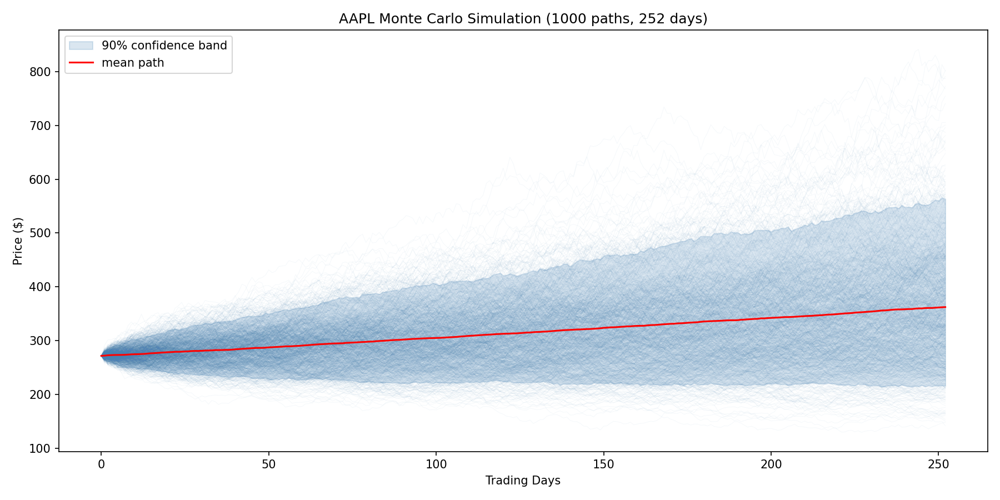
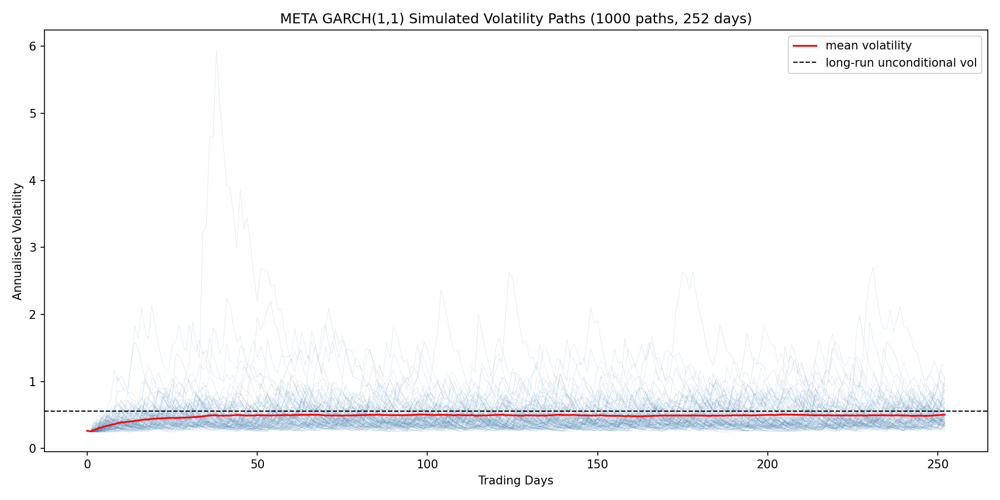
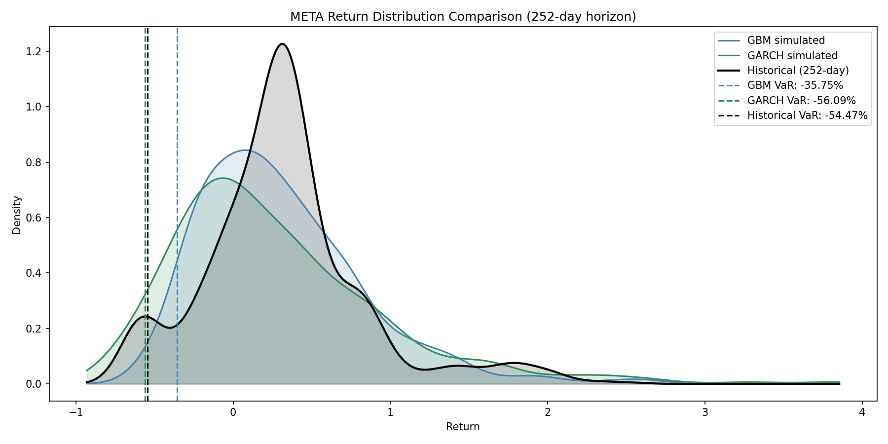
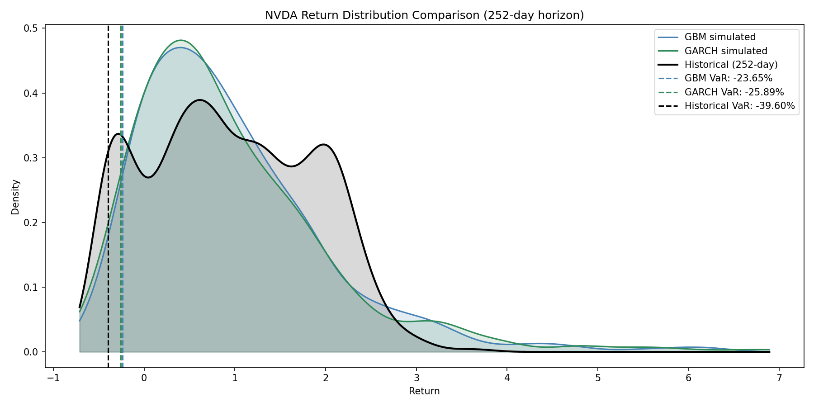
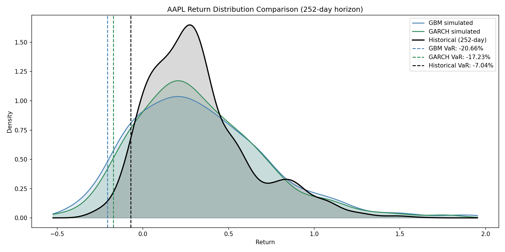

# Monte Carlo VaR Simulation

## Overview
A Monte Carlo simulation engine that models stochastic stock price paths using Geometric Brownian Motion (GBM) to estimate Value at Risk (VaR). Supports multiple tickers simultaneously, with comparison against Historical VaR. Extended with a GARCH(1,1) time-varying volatility model to produce state-dependent conditional VaR.

## Features
- User-defined ticker(s) and date range
- GBM simulation with 1,000 paths over 252 trading days
- GARCH(1,1) extension with time-varying conditional volatility
- 95% Monte Carlo VaR estimation under both constant and time-varying volatility
- Historical VaR (252-day holding period) for direct comparison with Monte Carlo VaR
- Visualisation: simulated price paths with 90% confidence band, return distribution histogram, GARCH volatility trajectories, and a three-way distribution comparison plot

## Strategy Logic
1. Download historical price data via `yfinance`
2. Estimate annualised drift (miu) and volatility (sigma) from historical daily returns
3. Simulate 1,000 independent price paths using GBM
4. Compute 95% Monte Carlo VaR as the 5th percentile of simulated final returns
5. Fit GARCH(1,1) on daily returns and simulate an additional 1,000 paths with time-varying volatility
6. Compute Historical VaR as the 5th percentile of actual 252-day holding period returns

## Methodology

### Geometric Brownian Motion (GBM)
GBM models stock prices as a continuous-time stochastic process where the percentage change in price follows a random walk with drift. The discrete-time approximation used in simulation is:

$$S_{t+1} = S_t \times e^{(\mu - \frac{1}{2}\sigma^2)\Delta t + \sigma\sqrt{\Delta t} \cdot Z}, \quad Z \sim N(0,1)$$

where:
- $S_t$ — stock price at time $t$
- $\mu$ — annualised drift rate, estimated as $\hat{\mu} = \bar{r} \times 252$
- $\sigma$ — annualised volatility, estimated as $\hat{\sigma} = s_r \times \sqrt{252}$
- $\Delta t = \frac{1}{252}$ — one trading day expressed in years
- $Z$ — standard normal random shock, sampled independently at each step

The term $-\frac{1}{2}\sigma^2$ is the Itô correction, which ensures the expected price follows $\mathbb{E}[S_t] = S_0 e^{\mu t}$ by adjusting for the asymmetry of log-normal compounding.

GBM satisfies the **Markov property**: $S_{t+1}$ depends only on $S_t$, not on the history of prior prices.

### Monte Carlo Simulation
1,000 independent paths are simulated over $T = 252$ trading days. Each path is a sequence $S_0, S_1, \ldots, S_{252}$ generated by applying the GBM update step with independently sampled $Z_t \sim N(0,1)$ at each step.



The final return of each path is:

$$r_i = \frac{S_{252}^{(i)} - S_0}{S_0}, \quad i = 1, 2, \ldots, 1000$$

### Monte Carlo VaR
The 95% VaR is the 5th percentile of the simulated return distribution:

$$\mathrm{VaR}_{0.95} = Q_{0.05}(r_1, r_2, \ldots, r_{1000})$$

Interpretation: there is a 5% probability that the loss over 252 trading days exceeds $\left|\mathrm{VaR}_{0.95}\right|$

### Historical VaR
Historical VaR is computed directly from empirical 252-day holding period returns, matching the same horizon as the Monte Carlo simulation:

$$\text{VaR}_{\text{hist}} = Q_{0.05}(r_1^{\text{hist}}, r_2^{\text{hist}}, \ldots, r_n^{\text{hist}})$$

where each $r_i^{\text{hist}} = \frac{P_{t} - P_{t-252}}{P_{t-252}}$ is the actual return from holding the stock for 252 trading days ending at day $t$.

## Results (2016–2026)

| Ticker | s0 | miu | sigma | VaR (Monte Carlo) | VaR (Historical, 252-day) |
|---|---|---|---|---|---|
| AAPL | $271.61 | 0.2867 | 0.2905 | -20.66% | -7.04% |
| META | $659.53 | 0.2627 | 0.3852 | -35.75% | -54.47% |
| NVDA | $186.49 | 0.6719 | 0.4989 | -23.65% | -39.60% |

Both VaR measures use a 252-day holding period. Monte Carlo VaR underestimates downside risk for META and NVDA relative to Historical VaR, reflecting fat tails in real return distributions that GBM's normal distribution assumption fails to capture. AAPL shows the opposite pattern, suggesting historically more stable 252-day returns than the model predicts.

## Extension: Time-Varying Volatility with GARCH(1,1)

### Motivation
The baseline GBM assumes constant volatility, estimated as the sample standard deviation of daily log returns over the full history. This averages the COVID-era volatility spike (March 2020) together with the quiet 2021 rally, systematically **underestimating crisis-era risk and overestimating tranquil-period risk**. In reality, volatility clusters: large moves tend to be followed by large moves, and calm periods persist. A conditional volatility model is needed to reflect the current state of the market.

### Model
GARCH(1,1) models the conditional variance of daily log returns as:

$$\sigma_t^2 = \omega + \alpha\, r_{t-1}^2 + \beta\, \sigma_{t-1}^2$$

- $\omega > 0$ — long-run variance anchor
- $\alpha$ — ARCH coefficient, sensitivity to yesterday's shock
- $\beta$ — GARCH coefficient, persistence of yesterday's variance

The price process is unchanged from baseline GBM, except $\sigma$ now varies over time:

$$S_{t+1} = S_t \times \exp\left((\mu - \tfrac{1}{2}\sigma_t^2) \Delta t + \sigma_t \sqrt{\Delta t} \cdot Z_t\right), \quad Z_t \sim N(0,1)$$

### Stationarity and the Unconditional Variance
Taking expectations under stationarity, $\mathbb{E}[\sigma_t^2] = \mathbb{E}[\sigma_{t-1}^2] \equiv \bar{\sigma}^2$, and $\mathbb{E}[r_{t-1}^2] = \bar{\sigma}^2$:

$$\bar{\sigma}^2 = \omega + \alpha \bar{\sigma}^2 + \beta \bar{\sigma}^2 \quad \Longrightarrow \quad \bar{\sigma}^2 = \frac{\omega}{1 - \alpha - \beta}$$

For a finite, positive unconditional variance, the **stationarity condition** is:

$$\alpha + \beta < 1$$

The quantity $\alpha + \beta$ is called **persistence**. Values close to 1 mean shocks to volatility decay slowly. The **half-life** of a variance shock is:

$$t_{1/2} = \frac{\log(0.5)}{\log(\alpha + \beta)}$$

For AAPL (persistence = 0.9534), $t_{1/2} \approx 14.5$ trading days — a volatility shock takes roughly three weeks to decay to half its initial magnitude.

### Implementation
`garch.py` fits the model with the `arch` library. Returns are scaled by 100 (to percentage) before fitting for numerical stability — the optimiser converges far more reliably on percentage-scale returns than on raw decimals — and the fitted variance is converted back to decimal scale after fitting.

Each simulated path updates $\sigma_t^2$ at every step using the previous path's return and variance, producing 1,000 independent volatility trajectories alongside the price paths.

**Conditional initialisation.** Paths are initialised at the **last-observed conditional variance** rather than the long-run unconditional variance. This produces a forecast conditional on today's market state: if today is calm, simulated volatility rises toward the long-run mean; if today is turbulent, simulated volatility decays toward the long-run mean. This is the standard industry approach for short-horizon VaR, as opposed to the unconditional initialisation used for long-horizon strategic forecasts.



The mean-reversion of the red volatility line from today's conditional σ toward the long-run unconditional σ (dashed line) is the signature behaviour of GARCH(1,1). The occasional blue path spiking above 400% annualised vol reflects the fat-tail regime that constant-σ GBM cannot represent.

### GARCH Results (2016–2026)

| Ticker | Current σ | Long-run σ | α | β | Persistence |
|---|---|---|---|---|---|
| AAPL | 17.62% | 28.45% | 0.1085 | 0.8449 | 0.9534 |
| META | 26.52% | 56.29% | 0.2495 | 0.6993 | 0.9488 |
| NVDA | 38.73% | 53.23% | 0.1477 | 0.7621 | 0.9098 |

| Ticker | GBM VaR | GARCH VaR | Historical VaR |
|---|---|---|---|
| AAPL | -20.66% | **-17.23%** | -7.04% |
| META | -35.75% | **-56.09%** | -54.47% |
| NVDA | -23.65% | **-25.89%** | -39.60% |

*All σ values are annualised from daily GARCH output by multiplying by √252; α, β, and persistence are daily GARCH parameters.*

### Analysis

To directly assess each model's fit to reality, the return distributions produced by GBM, GARCH, and historical 252-day rolling returns are overlaid on the same axis for each ticker, with the corresponding VaR levels marked as vertical dashed lines.

**META — GARCH recovers the fat tail GBM misses.** The most dramatic improvement.



GBM's VaR of -35.75% is far more optimistic than the -54.47% observed historically, because a single constant σ = 38.52% cannot represent a distribution where volatility itself can spike to 100%+ (as in the 2022 drawdown). GARCH's VaR of -56.09% almost exactly matches the historical figure — the green and black dashed lines are visually indistinguishable, while the blue GBM line sits nearly 20 percentage points to the right. The underlying mechanism is visible in the GARCH density: its left tail extends considerably beyond GBM's, because META's α = 0.2495 is unusually high, allowing simulated paths to occasionally cascade into regimes where shocks feed back into higher future volatility. This is precisely the fat-tail behaviour that constant-σ GBM structurally cannot represent.

**NVDA — a partial improvement, and an honest limit.** GARCH moves VaR from -23.65% to -25.89%, closer to the historical -39.60% but still well short.



The three simulated densities (blue and green) overlap almost completely, and both terminate well before the historical tail extending to -70%. Two factors limit the improvement: NVDA's current σ (38.73%) is not far below its long-run σ (53.23%), so the conditional adjustment is modest; and historical NVDA includes the 2022 AI-hype drawdown of roughly -66%, which even fat-tailed Gaussian GARCH cannot fully reproduce. Closing this gap would require **Student-t innovations**, which sample from heavy-tailed distributions directly.

**AAPL — the reverse case, and why it matters.** GARCH VaR (-17.23%) is actually *less* conservative than GBM VaR (-20.66%).



This is not a model defect but a feature of conditional VaR: AAPL's current conditional σ of 17.62% is far below the long-run 28.45%, so GARCH reports that short-horizon risk is currently lower than the long-run average. GBM, using a single blended σ = 29.05%, cannot express this — it treats every day as though the market is at long-run risk level. The historical density (black) is strikingly narrower and taller than either simulated density, and Historical VaR of only -7.04% reflects AAPL's exceptional ten-year uptrend: no rolling 252-day window produced a loss exceeding 7%. Both simulated models are therefore more conservative than history for AAPL, with GARCH correctly positioned between the two. This case also illustrates a broader point: **Historical VaR is itself unreliable in strongly trending regimes**, because the empirical tail depends entirely on whether the sample period happens to contain a drawdown.

### Key Insight: Conditional VaR Depends on Market State

The three tickers illustrate that GARCH does not uniformly produce more or less conservative VaR than GBM — it produces a VaR **conditional on today's market state**:

| Scenario | Characterisation | GARCH vs GBM | Example |
|---|---|---|---|
| Currently calm, long-run moderate | current σ ≪ long-run σ, both reasonable | GARCH **less conservative** | AAPL |
| Currently calm, long-run extreme | current σ ≪ long-run σ, long-run includes crisis periods | GARCH **much more conservative** | META |
| Currently moderate, long-run moderate | current σ ≈ long-run σ | GARCH **marginally more conservative** | NVDA |

This is the core value of GARCH for practical risk management: it allows VaR to reflect the actual volatility regime of today, rather than a blended average that is simultaneously wrong for calm and turbulent periods.

### Limitations of GARCH(1,1)
- **Symmetric response to shocks.** GARCH(1,1) treats $+5\%$ and $-5\%$ returns identically through the $r_{t-1}^2$ term. Empirically, negative shocks raise future volatility more than positive shocks of the same magnitude — the **leverage effect**. Models such as **EGARCH** and **GJR-GARCH** address this by introducing asymmetric response terms.
- **Gaussian innovations.** The shock term $Z_t \sim N(0, 1)$ is normally distributed. Even with time-varying variance, the resulting return distribution has tails that are too thin to match real equity returns. A **Student-t** innovation distribution would produce fatter-tailed paths and likely close the remaining gap between GARCH and historical VaR on NVDA.
- **Single volatility regime.** Model parameters are estimated on the full sample, implicitly assuming that the volatility process is stable. In reality, volatility regimes shift (e.g. pre- vs post-COVID, pre- vs post-interest-rate-hiking cycle). A **regime-switching GARCH** or rolling-window re-estimation would be more faithful to this structural reality.
- **One-step-ahead forecasting only.** GARCH models the conditional variance given information up to $t-1$. Longer-horizon forecasts mean-revert to $\bar{\sigma}^2$ and discard path-dependent information about volatility cycles.

## Limitations
- **Normal distribution assumption**: GBM assumes log-returns are normally distributed. Real returns exhibit fat tails and negative skew, causing Monte Carlo VaR to systematically underestimate extreme losses.
- **Constant volatility (in baseline GBM)**: Addressed by the GARCH(1,1) extension above.
- **Bootstrap resampling** is an alternative that avoids distributional assumptions by sampling directly from historical returns, preserving fat tails naturally. However, it is historically bounded and cannot model unseen market regimes.
- **Parameter stability**: miu and sigma are assumed constant and equal to their historical estimates. Structural changes in a company or macro environment can invalidate this assumption.
- **Historical VaR sample dependence**: Empirical tail quantiles are determined entirely by whether the sample window contains a major drawdown. In strongly trending regimes (e.g. AAPL 2016–2026), Historical VaR can substantially underestimate forward risk.
- **Single-asset model**: VaR is computed per ticker independently, ignoring cross-asset correlations. A portfolio-level extension using a covariance matrix would be more realistic.

## How to Run
```bash
pip install -r requirements.txt
python main.py
```
Enter ticker(s), start date, and end date when prompted.

## Project Structure
```
.
├── main.py         # entry point: orchestrates data, simulation, VaR, plotting
├── data.py         # yfinance download and annualised parameter estimation
├── simulation.py   # GBM price path simulation
├── garch.py        # GARCH(1,1) fitting and time-varying volatility simulation
├── var.py          # Monte Carlo VaR and Historical VaR calculation
├── plot.py         # price path, return distribution, and volatility plots
├── checkdate.py    # user-input date parsing and validation
└── requirements.txt
```
